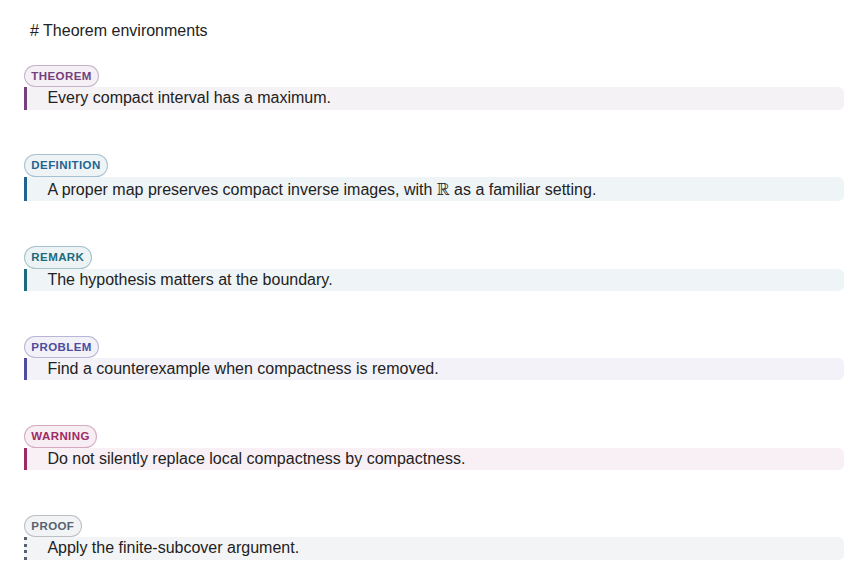
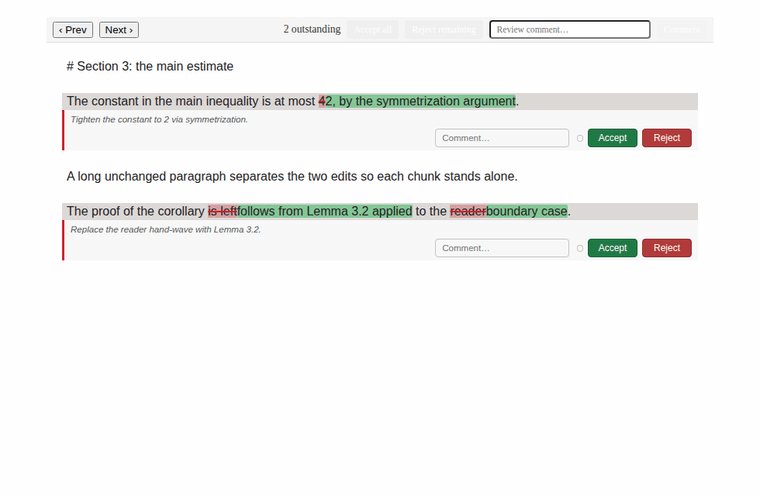

# zettlr-pandoc

A fork of [Zettlr](https://github.com/Zettlr/Zettlr) that swaps its math rendering engine for MathJax and adds user-configurable TeX macros shared between the editor and Pandoc export.

Everything not described here is unchanged from upstream Zettlr.
For installation, features, and general use, see the [Zettlr repository](https://github.com/Zettlr/Zettlr) and [documentation](https://docs.zettlr.com/); to build, follow the upstream [development guide](https://github.com/Zettlr/Zettlr#building-from-source).

## What's different from Zettlr

- **MathJax instead of KaTeX.** Math is rendered with MathJax (CommonHTML), bundled locally with no CDN dependency, including [mhchem](https://mhchem.github.io/MathJax-mhchem/) for chemistry.

- **Configurable TeX macros.** Define your own macros in a config file; the same set is used both in the editor and in every export (see below).

- **Every export goes through Pandoc.** HTML, LaTeX, and PDF all run through Pandoc, so your configured filters and templates always apply and exported math matches what you see in the editor.
  (The upstream Chromium "Simple PDF" export, which bypassed Pandoc and silently ignored filters and templates, has been removed.)

## What it looks like

Everything below is captured from the real editor renderers; `just readme-demos <dir>` regenerates all of it.

### Math renders as you type

Math shows its LaTeX source while the cursor is inside it and renders with MathJax the moment the cursor leaves — including your own macros (here `\RR`):


### Theorem environments

Pandoc fenced divs (`::: theorem`, `::: proof`, …) render as styled environments while the document stays plain Pandoc markdown:




### Reviewing external edit propositions

An external tool (an agent, a script — see [External review propositions](#external-review-propositions)) can propose edits to the open document. Each changed chunk is adjudicated in the editor: accept it, annotate it with a comment, or reject it to restore the original text:



## MathJax macros

On first run the app writes a default set of standard macros to a single file in its configuration directory, which you can edit directly:

- **Linux:** `~/.config/Zettlr-Pandoc/mathjax-macros.json`

- **macOS:** `~/Library/Application Support/Zettlr-Pandoc/mathjax-macros.json`

- **Windows:** `%APPDATA%\Zettlr-Pandoc\mathjax-macros.json`

Edit that file and restart the app to change your macros — they are loaded once at startup.
The app never overwrites your edits (it only writes the defaults when no file exists yet), so to reset you can delete the file and restart.

The file uses the standard MathJax [`tex.macros`](https://docs.mathjax.org/en/latest/input/tex/macros.html) shape: a JSON object mapping each macro name to its definition — a replacement string, or `[replacement, argCount]`, or `[replacement, argCount, optionalDefault]`:

```json
{
  "RR": "\\mathbb{R}",
  "abs": ["\\left\\lvert {#1} \\right\\rvert", 1],
  "poly": ["{#1}[{#2}]", 2, "x"]
}
```

Any MathJax-compatible macro export uses this same shape, so a macro set you already maintain (for example a Pandoc macro export) can replace the file unchanged — copy or symlink it into place.
If the file is malformed, the app reports the error rather than silently ignoring it.

## Building and running

The build is identical to upstream Zettlr.
A `justfile` wraps the common tasks:

- `just launch` — run in development mode

- `just package` — build a packaged Linux (x64) app

- `just run-packaged` — run the built binary

## External review propositions

Install the desktop launcher to expose the standalone review command:

```sh
just install-desktop-launcher
zettlr-pandoc-review-diff \
  --document /path/to/document.md \
  --patch /path/to/proposition.diff \
  --description "Review proposition" \
  --port 27412
```

The running editor validates and applies the unified patch.
The command exits nonzero when the editor refuses the proposition.

## License

This software is licensed via the [GNU GPL v3-License](https://www.gnu.org/licenses/gpl-3.0.en.html), as is upstream Zettlr.

The Zettlr brand (including name, icons, and everything Zettlr can be identified with) is excluded and all rights reserved.
[Read about the logo usage](https://www.zettlr.com/press#usage-rights).
